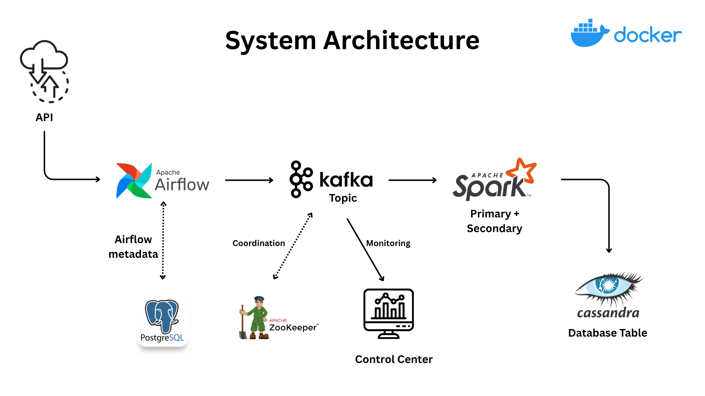

# Airflow → Kafka → Spark Structured Streaming → Cassandra (WSL + Docker)

Pipeline:
- Airflow DAG pulls RandomUser API and publishes JSON to Kafka (`users_created`).
- Spark Structured Streaming reads from Kafka, creates Cassandra schema, and writes rows.
- Cassandra stores `spark_streams.created_users`.

## System Architecture



## Stack
- Confluent Kafka (broker, zookeeper, control center)
- Apache Airflow (webserver, scheduler, Postgres metadata)
- Spark 3.5.1 (master, worker)
- Cassandra

## Quick start

```bash
docker compose up -d
# produce data via Airflow task (or use UI)
docker compose exec scheduler airflow tasks test \
  user_automation stream_data_from_api 2025-08-10

# confirm Kafka topic exists (optional)
docker compose exec broker kafka-topics --bootstrap-server broker:29092 --describe --topic users_created

# submit streaming job
docker compose exec spark-master /opt/bitnami/spark/bin/spark-submit \
  --master spark://spark-master:7077 \
  /opt/spark-apps/spark_stream.py
```

## Verify
```bash
docker compose exec cassandra_db cqlsh -e "
USE spark_streams;
SELECT count(*) FROM created_users LIMIT 1;"
```

## Notes
 - Topic auto-creation handled by DAG ensure_topic() (and optional Spark config).
 - Containers communicate via service DNS names: broker:29092, cassandra.
 - Checkpoints are ephemeral unless mapped to a volume.

## Info for cold start
 - UnknownTopicOrPartitionException on Spark submit job? → run DAG first via UI or CLI
 - Airflow → port 8080
 - Control Center → port 9021